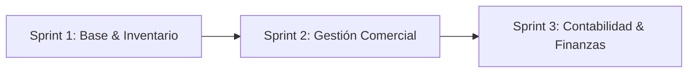

# NexoERP — Sistema ERP Comercial y Contable (SaaS Multi-Inquilino)

[](https://github.com/DrAlastor/erp-web/actions/workflows/deploy-frontend.yml)
[](https://erp-contable-comercial.online)
[-6db33f?logo=springboot)](https://spring.io/projects/spring-boot)
[](https://gradle.org)
[](https://angular.dev)
[](https://www.postgresql.org)

Plataforma empresarial de planificación de recursos (ERP) orientada a la **gestión comercial y contabilidad automatizada**, desarrollada bajo el modelo **SaaS Multi-inquilino** para la materia **Sistemas de Información 2** (Facultad de Ciencias de la Computación y Telecomunicaciones — **UAGRM**).

🌐 **Enlace Oficial en Producción:** [https://erp-contable-comercial.online](https://erp-contable-comercial.online)

---

## 📌 Visión y Propuesta de Valor

El sistema está concebido para adaptarse a **cualquier tipo de empresa o rubro comercial** (importadoras, distribuidoras, mayoristas, tecnología, farmacias, retail o servicios):

* 🏢 **Arquitectura SaaS Multi-Tenant**: Cada empresa que contrate el sistema se registra y dispone de su propio entorno hermético en la base de datos. Ninguna empresa puede ver ni acceder a los datos de otra (*Data Isolation*).
* ⚖️ **Sinergia Comercial y Contable Automática**: Cada operación comercial (compras, notas de venta, cobros) genera de forma inmediata su respectivo **asiento contable en el Libro Diario**, manteniendo el balance cuadrado (*Debe = Haber*) sin requerir conocimientos contables avanzados por parte del vendedor.
* 📱 **Preventa Móvil en Ruta**: Integración directa con la aplicación móvil Android desarrollada en Flutter (`erp-movil/`), permitiendo a los agentes en calle registrar pedidos con sincronización y reserva de stock en tiempo real.

---

## 👥 Equipo de Ingeniería y Desarrollo (Full Stack)

| Integrante | Rol en el Proyecto | Especialidad Técnica |
|---|---|---|
| **Arteaga Silva Geimbert Santiago** | Desarrollador Full Stack | Angular, Spring Boot, Base de Datos |
| **Mopy Cabezas Leonardo** | Desarrollador Full Stack | Angular, Spring Boot, Seguridad Multi-tenant |
| **Perez Leon Luis Enrique** | Desarrollador Full Stack | Angular, REST APIs, Persistencia |
| **Quispe Mamani Javier** | Desarrollador Full Stack | Angular, Lógica Comercial y Facturación |
| **Verduguez Teran Nicolas Junior** | Desarrollador Full Stack | Angular, Automatización Contable, PostgreSQL |
| **Yevara Ponce Alessandro** | Desarrollador Full Stack | Angular, Spring Boot, Despliegue Cloud & Flutter |

---

## 📋 Planificación Ágil (Metodología SCRUM)

El proyecto está organizado en **3 Sprints**, cubriendo un total de **20 Casos de Uso**:



### 🚀 Sprint 1 — Fundamentos, Seguridad e Inventario (En Curso)
> **Objetivo:** Construir la base del sistema, controlar el acceso y disponer de la información maestra e inventario necesarios para operar el ERP (1 caso de uso por integrante).

* `CU-01`: Gestionar Acceso al Sistema (Autenticación JWT, control de sesiones y tenant context).
* `CU-02`: Gestionar Usuarios y Credenciales (CRUD y asignación por empresa).
* `CU-03`: Gestionar Roles y Permisos (Matriz de control de acceso RBAC).
* `CU-05`: Gestionar Clientes (Directorio maestro, NIT/CI, condiciones comerciales).
* `CU-08`: Gestionar Catálogo de Artículos (SKU, categorías, unidades de medida, stock mínimo).
* `CU-09`: Gestionar Movimientos de Inventario (Kardex físico, entradas, salidas y transferencias).

### 📦 Sprint 2 — Gestión Comercial y Facturación
> **Objetivo:** Implementar el flujo comercial completo desde cotizaciones hasta despacho y facturación.
> *Flujo:* `Cliente → Cotización → Pedido → Validaciones → Despacho → Venta → Facturación`

* `CU-06`: Gestionar Precios y Descuentos
* `CU-07`: Gestionar Cotizaciones
* `CU-08`: Gestionar Pedidos de Venta
* `CU-09`: Gestionar Despachos de Venta
* `CU-13`: Gestionar Ventas y Facturación
* `CU-14`: Anular Comprobante de Venta
* `CU-15`: Consultar y Exportar Registro de Ventas

### 📊 Sprint 3 — Contabilidad, Finanzas y Gestión
> **Objetivo:** Integración comercial con contabilidad automática y reportes gerenciales auditables.
> *Flujo:* `Venta/Despacho/Cobro → Asientos Contables → Información Financiera → Indicadores`

* `CU-04`: Consultar Bitácora de Auditoría
* `CU-16`: Gestionar Plan de Cuentas Contable
* `CU-17`: Gestionar Asientos Contables Automáticos y Manuales
* `CU-18`: Gestionar Cuentas por Cobrar y Cobros
* `CU-19`: Gestionar Caja y Cierres Diarios
* `CU-20`: Consultar Información Financiera (Balance General, Estado de Resultados)
* `CU-21`: Consultar Indicadores Gerenciales (KPIs)

---

## 🛠️ Stack Tecnológico

### Frontend
* **Framework:** Angular 22 (con soporte SSR y Signals reactivos).
* **Estilos:** Vanilla SCSS estructurado con arquitectura de componentes y diseño responsivo (*Light Tech Premium*).
* **Tipografía:** Plus Jakarta Sans & JetBrains Mono.

### Backend
* **Lenguaje & Framework:** Java 21 LTS / Spring Boot 3.3.5.
* **Build Tool:** Gradle 8.11 (con Gradle Wrapper).
* **Seguridad:** Spring Security con Tokens JWT criptográficos e inyección de `empresa_id` (Tenant Context).
* **Persistencia:** Spring Data JPA / Hibernate con filtros multi-tenant.

### Base de Datos & Contenedores
* **Motor:** PostgreSQL 16.
* **Contenedores:** Docker & Docker Compose (`docker-compose.yml`).

### Despliegue en la Nube (AWS & CI/CD)
* **Hosting Frontend:** Amazon S3 (Static Website Hosting).
* **CDN & Certificados SSL:** Amazon CloudFront con certificado TLS emitido por Amazon Certificate Manager (ACM).
* **Automatización:** GitHub Actions (`deploy-frontend.yml`) con sincronización automática e invalidación de caché ante cada `push` a `main`.

---

## 💻 Ejecución Local

### Prerrequisitos
* Node.js >= 22 (Recomendado 24 LTS)
* Java JDK 21 LTS
* Docker y Docker Compose

### 1. Clonar el repositorio
```bash
git clone https://github.com/DrAlastor/erp-web.git
cd erp-web
```

### 2. Iniciar Base de Datos (Docker)
```bash
docker-compose up -d postgres
```

### 3. Ejecutar el Backend (Spring Boot)
```bash
cd backend
./gradlew bootRun
```
El servidor backend responderá en: `http://localhost:8080`

### 4. Ejecutar el Frontend (Angular)
```bash
cd ../frontend
npm install
npm run dev
```
La aplicación web responderá en: `http://localhost:4200`

---

## 📄 Licencia y Créditos
Proyecto académico desarrollado para la materia **Sistemas de Información 2 (INF-412)** — Semestre 2026.  
**Facultad de Ciencias de la Computación y Telecomunicaciones (FICCT)**  
*Universidad Autónoma Gabriel René Moreno (UAGRM)*.
